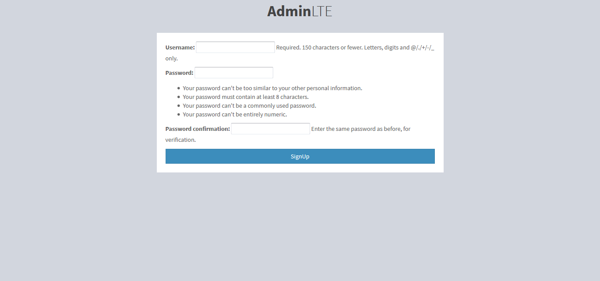
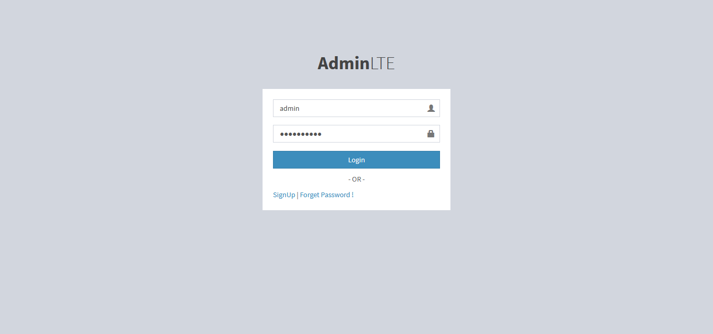
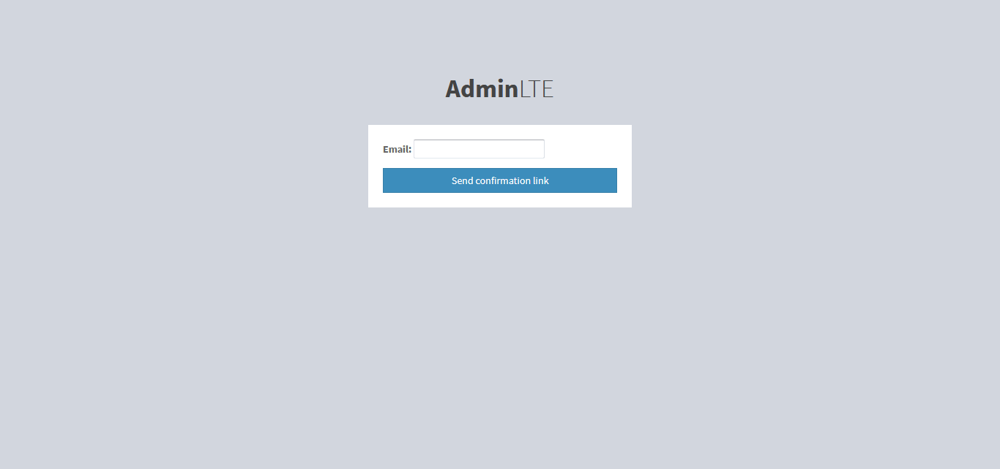
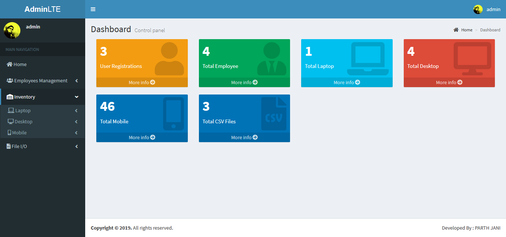
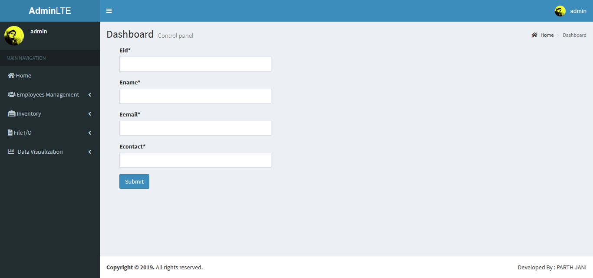

# Django-Python-Admin-LTE2-CRUD-File-IO
This is a Django project to demonstrate Django CRUD functionality using python and Admin LTE 2 Template,in this project user can Perfome CRUD Operation &amp; File I/O Operation.

# Using Technology :
- Python 3.7
- Django 2.1
- MySql
- Admin LTE2 HTML Theme

# Recommended
Make sure that all required packages should be installed in your virtual environment.

# Virtual Environment for this Repository
Download from this link : https://bit.ly/2TzxXfB

# Django AdminLTE2 Theme 
Django AdminLTE 2 Documentation Download from : https://bit.ly/2TMfECY

Django AdminLTE 2 Theme Download from : https://bit.ly/2SY7VgU

# Steps
- Activate Virtual Environment
- Set directory path of project
- python manage.py makemigrations
- python manage.py migrate
- python manage.py runserver
- Paste this url in your browser : http://127.0.0.1:8000/

# Screen Shot

